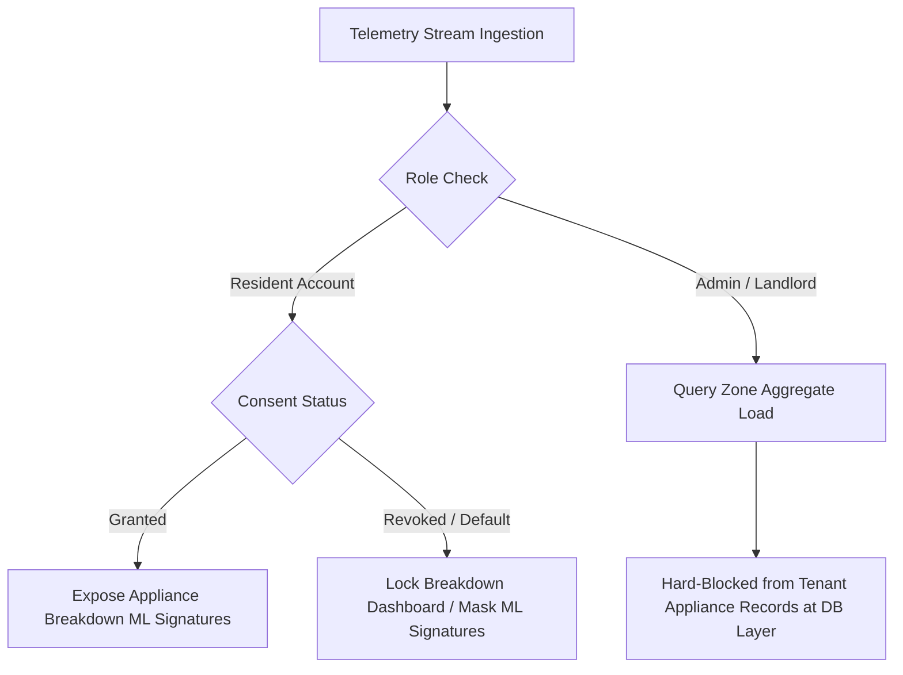

# GridPulse — Smart Energy Monitoring & Analytics Platform (Prototype)

GridPulse is a production-grade, software-driven Progressive Web App (PWA) prototype designed for real-time electricity tracking, automated consumption forecasting, and multi-tenant sub-meter billing management. 

By replacing physical electrical sub-meter hardware with a high-fidelity software simulator, GridPulse demonstrates how high-frequency consumption monitoring can eliminate "bill shock," optimize building facility operations, and remain strictly compliant with the **Malaysian Personal Data Protection Act (PDPA)**.

---

## ⚡ Key Objectives & Business Goals

1. **User Financial Well-Being (Predictive Bill Shock Alerts)**: Deliver real-time, actionable insights into household electricity usage, allowing residents to set warnings and track their live usage projection to eliminate unexpected utility expenses.
2. **Operational Efficiency (Traffic Light Dashboard)**: Replace error-prone manual meter readings with real-time aggregate tracking of building zones, flagging simulated facility anomalies (e.g., stuck water pumps, faulty common area timers) before billing cycles conclude.
3. **User Privacy Safeguards (PDPA Compliance)**: Enforce a strict opt-in consent flow to isolate granular tenant appliance telemetry from property administrators and third parties.
4. **Fractional Billing & Portfolio Management**: Enable landlords to assign virtual sensors to custom zones for fractional room billing, while granting multi-property developers consolidated oversight across their entire real estate portfolio.

---

## 🏗️ Technical Architecture & Monorepo Structure

GridPulse is structured as an NPM workspaces monorepo separating frontend, backend, and simulator code:

```
├── packages
│   ├── backend     # NestJS microservice API gateway & anomaly evaluator
│   ├── frontend    # React (Vite) PWA web client with offline Dexie cache
│   └── simulator   # Node.js virtual smart plug & telemetry streaming engine
├── docker-compose.yml
├── package.json
└── README.md
```

### System Architecture Topology

```
                  ┌──────────────────────────────────────────────┐
                  │          [packages/simulator]                │
                  │   High-Fidelity Telemetry Generator Engine   │
                  └──────────────────────┬───────────────────────┘
                                         │
                                         │ (Simulated MQTT over WSS)
                                         ▼
                  ┌──────────────────────────────────────────────┐
                  │           [packages/backend]                 │
                  │       NestJS API Gateway Service             │
                  │  (JWT Auth, Tariffs & Anomaly Evaluators)    │
                  └──────┬───────────────────────────────▲───────┘
                         │                               │
       (WSS Broadcast /  │                               │ (API Requests /
        Push Updates)    │                               │  Sync Logs)
                         ▼                               │
    ┌──────────────────────────────────────────┐         │
    │          [packages/frontend]             │         │
    │        React + Vite Client PWA           ├─────────┘
    │  (Dexie.js / IndexedDB Offline Cache)    │
    └──────────────────────────────────────────┘
                         ▲
                         │ (Read / Write)
                         ▼
        ┌──────────────────────────────────┐
        │  TimescaleDB & PostgreSQL (Local)│
        │   (Fallback: In-Memory DB Store) │
        └──────────────────────────────────┘
```

---

## 💾 Database Schema Design

GridPulse utilizes a hybrid database layer. In production environments, it coordinates a relational structure in **PostgreSQL** alongside time-series hypertables managed inside **TimescaleDB**. 

If a database instance is not running locally, the backend automatically fails over to an dynamic **In-Memory Mock Database Store** to ensure immediate prototype usability.

### Relational Schema & Hypertables (`packages/backend/src/database/schema.sql`)

#### 1. Users Table (PostgreSQL)
Stores profile credentials and handles Single Sign-On (SSO) mapping.
* `id` (SERIAL PRIMARY KEY): Unique identifier.
* `email` (VARCHAR(255) UNIQUE NOT NULL): Profile login mapping.
* `display_name` (VARCHAR(255) NOT NULL): Display moniker.
* `role` (user_role ENUM): System authorization scopes (`Resident`, `Admin`, `Super Admin`, `Support`).
* `created_at` (TIMESTAMPTZ DEFAULT NOW()): Account registration timestamp.

#### 2. Consent Logs (PostgreSQL)
Provides an immutable audit trail mapping PDPA consent preferences.
* `id` (SERIAL PRIMARY KEY)
* `user_id` (INT REFERENCES users)
* `consent_type` (VARCHAR(100)): Category of data usage permission (e.g., `appliance_breakdown`).
* `status` (consent_status ENUM): System permission flag (`Granted`, `Revoked`).
* `timestamp` (TIMESTAMPTZ DEFAULT NOW())

#### 3. Zone Mappings (PostgreSQL)
Maps virtual sensors and units to specific rooms, properties, or building common areas.
* `id` (VARCHAR(100) PRIMARY KEY): E.g., `zone-a1`.
* `name` (VARCHAR(255)): Human-readable zone name (e.g., `Unit A-201`).
* `floor` (VARCHAR(100)): Location level.
* `type` (VARCHAR(50)): Classification (`Residential`, `Common Area`, `Utility`).
* `devices` (TEXT[]): Associated device IDs (e.g., `['device-aircon-01', 'device-fridge-01']`).
* `tenant` (VARCHAR(255)): Name of the resident or entity responsible for the zone.
* `created_at` (TIMESTAMPTZ DEFAULT NOW())

#### 4. Energy Telemetry (TimescaleDB Hypertable)
Ingests and indexes high-frequency electricity records.
* `timestamp` (TIMESTAMPTZ NOT NULL)
* `device_id` (VARCHAR(100) NOT NULL): Target simulator node.
* `device_name` (VARCHAR(100) NOT NULL): Human-readable device label.
* `status` (VARCHAR(50) NOT NULL): Connection status (`Active`, `Offline`, `Error`).
* `load_kw` (DOUBLE PRECISION NOT NULL): Live load capacity in kilowatts.
* `voltage` (DOUBLE PRECISION NOT NULL): Measured voltage in volts (V).

#### 5. Anomaly Alerts (TimescaleDB Hypertable)
Keeps an archive of triggered grid alerts and equipment warnings.
* `timestamp` (TIMESTAMPTZ NOT NULL)
* `alert_id` (VARCHAR(50) NOT NULL)
* `device_id` (VARCHAR(100) NOT NULL)
* `device_name` (VARCHAR(100) NOT NULL)
* `zone` (VARCHAR(100) NOT NULL)
* `type` (VARCHAR(50) NOT NULL): Trigger rules (`sustained_load`, `over_current`, `offline_timeout`, `voltage_anomaly`).
* `severity` (VARCHAR(20) NOT NULL): Alert severity index (`Critical`, `High`, `Medium`).
* `title` (TEXT NOT NULL): Description of the event.
* `value` (DOUBLE PRECISION NOT NULL): The reading that triggered the alert.
* `threshold` (DOUBLE PRECISION NOT NULL): The threshold that was exceeded.

---

## 🔒 Personal Data Protection Act (PDPA) Compliance Architecture

GridPulse enforces strict user privacy compliance matching the **Malaysian Personal Data Protection Act (PDPA)** standards:



* **Explicit Opt-In Gate**: Detailed appliance-level signatures remain strictly locked behind a consent overlay. Granular tracking requires explicit consent confirmation (`ConsentFlow.jsx`).
* **Instant Revocation**: If a resident revokes permission, the system immediately flags the database ledger and terminates live extraction of appliance-level signatures.
* **Cryptographic Isolation**: Database query layers restrict property administrators to aggregate building and zone metrics. Individual appliance breakdown records cannot be fetched by management accounts.

---

## 🚀 Core Features & Role-Based Workspaces

The platform hosts four role-based dashboard layout workspaces:

### 1. Resident Workspace (`ResidentLayout.jsx` & components)
* **Real-Time Cost Assessment**: High-frequency load telemetry mapped against Malaysian Tenaga Nasional Berhad (TNB) tiered domestic tariffs to estimate monthly cost details in Ringgit Malaysia (RM).
* **Predictive Forecasting**: Projects monthly end-of-cycle bills based on rolling consumption patterns.
* **Budget configurator**: Enables custom bill shock thresholds that trigger warning alerts instantly.
* **Appliance Analytics & Correction**: Ranked lists of highest consuming appliances. Includes a **Label Correction Utility** (`ApplianceCorrectionModal.jsx`) that registers user modifications to queue classifier retraining.

### 2. Landlord / Property Admin Workspace (`AdminLayout.jsx` & components)
* **Building Operations Tracker**: Monitors aggregate loads across shared facilities (e.g., corridors, lobby).
* **Equipment Anomaly Alerts**: Flags operational deviations (sustained heavy draw, voltage anomalies, and offline timeouts) to trace system failure vectors immediately.
* **Zone Mapper**: Connects sub-meter nodes (`ZoneMapper.jsx`) to units for fractional sub-let invoices.
* **Immutable Audit Trail**: Logs critical administrative updates for complete logging accountability.

### 3. Portfolio Super Admin Workspace (`SuperAdminLayout.jsx` & pages)
* **Command Center**: Tracks power strains, connectivity, and billing metrics across all registered assets.
* **Accounting Exporter**: Generates PDF and CSV statements conforming to standard TNB structures.

### 4. Support Desk Workspace (`SupportLayout.jsx` & pages)
* **System Diagnostics**: Displays WebSocket frame transmission latency.
* **WebSocket Terminal**: A live inspect viewer (`DiagnosticTerminal.jsx`) showing JSON data telemetry payloads in real time.

---

## 🛠️ Telemetry Simulator Spec (`packages/simulator`)

The simulator mimics physical energy grid nodes (`index.js`). It reads configuration parameters from `devices.json` and connects to the backend over WebSocket channels.

```javascript
// Cyclic load calculation formula
const cyclePhase = (2 * Math.PI * timeSec) / cyclePeriodSec;
const base = device.baseLoadKw;
const variance = device.varianceKw * Math.sin(cyclePhase);
const noise = (Math.random() - 0.5) * 0.05 * device.baseLoadKw;
loadKw = Math.max(0, base + variance + noise);
```

### Configured Devices (`devices.json`)
1. **AirCon** (`device-aircon-01`): Heavy load cyclic demand (base 1.5 kW, cycle 15 min).
2. **Refrigerator** (`device-fridge-01`): Continuous low load (base 0.15 kW, cycle 45 min).
3. **Water Pump** (`device-pump-01`): High load mechanical draw (base 2.2 kW, cycle 10 min).
4. **Common Area Lights** (`device-light-01`): Continuous low draw (base 0.3 kW, cycle 120 min).
5. **Stuck Facility Timer** (`device-anomaly-timer`): High load constant draw (base 4.5 kW, static cycle).

---

## 📈 Anomaly Detection Engine

The backend evaluates live telemetry metrics using sliding window heuristics (`anomaly.service.ts`):

| Anomaly Type | Trigger Heuristic | Default Threshold | Severity | Description |
| :--- | :--- | :--- | :--- | :--- |
| **Instant Over-Current Spike** | Single load reading exceeds limit | `>= 5.0 kW` | **Critical** | Flags heavy startup draws or short circuits. |
| **Sustained Heavy Load** | Load remains above limit for `N` cycles | `>= 3.5 kW` for 5 cycles | **High** | Catches stuck facility equipment or mining rigs. |
| **Voltage Anomaly** | Measured voltage drops/spikes beyond safety levels | `< 210 V` or `> 260 V` | **Medium** | Flags transformer fluctuations or grid faults. |
| **Node Heartbeat Timeout** | Zero updates received from device within time window | `> 30 seconds` | **Medium** | Identifies local physical sensor dropouts. |

---

## 🔌 Getting Started & Running Locally

### Prerequisites
* **Node.js** (v18 or higher recommended)
* **npm** (v9 or higher)
* *Optional*: **Docker & Docker Compose** (to run the physical database)

### Installation
1. Clone the repository and install all workspace dependencies:
   ```bash
   npm install
   ```

2. *(Optional)* Launch the PostgreSQL / TimescaleDB Docker container:
   ```bash
   npm run docker:db
   ```
   *Note: If Docker is not available, the backend automatically transitions to using local in-memory mock datasets.*

### Starting the Ecosystem Concurrently
Launch all workspace services concurrently:

```bash
# 1. Run the Backend API Service (runs on http://localhost:3000)
npm run dev:backend

# 2. Run the Telemetry Simulator (pushes websocket streams to backend)
npm run dev:simulator

# 3. Run the React Web Client (runs on http://localhost:5173)
npm run dev:frontend
```

---

## 🧪 Testing the Prototype

Once the web portal opens at `http://localhost:5173`, use the preset SSO login credentials to explore the roles:

| Persona | Credential Email | Description & Key Tests |
| :--- | :--- | :--- |
| **Resident** | `resident@example.com` | Test PDPA consent opt-in, review tiered bill estimates, set thresholds, submit appliance label overrides. |
| **Landlord / Admin** | `admin@example.com` | Map sub-meters, inspect common area logs, resolve issue alerts, view audit trail log. |
| **Super Admin** | `superadmin@example.com` | Access portfolio view, review multi-property indices, run accounting PDF/CSV exporter. |
| **Support Agent** | `support@example.com` | Open the diagnostic console, check websocket latency, monitor raw JSON payloads. |

### 🛠️ Developer Mode Hot-Swapping
For convenience during local evaluations, you can bypass manual logins. Navigate to **Settings** and look for the **Developer Mode Role Switcher** at the bottom of the page. This component permits hot-swapping between all roles and layouts instantly.

