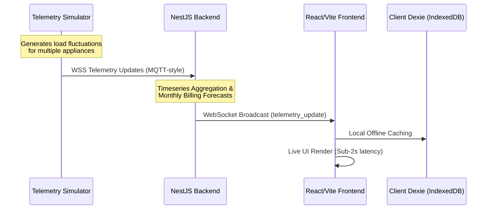

# GridPulse — Smart Energy Monitoring & Analytics Platform (Prototype)

GridPulse is a software-driven Progressive Web App (PWA) prototype designed for real-time electricity tracking, automated consumption forecasting, and multi-tenant sub-meter billing management. 

By replacing physical electrical sub-meter hardware with a high-fidelity software simulator, GridPulse demonstrates how high-frequency consumption monitoring can eliminate "bill shock," optimize facility operations, and remain strictly compliant with the **Malaysian Personal Data Protection Act (PDPA)**.

---

## ⚡ What is GridPulse for?

Traditional electrical utility platforms (such as MyTNB) provide delayed consumption data, leading to unexpected utility bills and tenant-landlord disputes. GridPulse solves this by providing:

1. **Reactive to Proactive Tracking**: Residents monitor usage in real-time, receiving automated warnings the moment their monthly forecast exceeds custom budget limits.
2. **Operational Transparency for Landlords**: Property managers track common areas and complex-wide demand aggregates to identify leaks (e.g., stuck water pumps, failed lighting timers) without manual meter readings.
3. **Tenant Privacy Safeguards (PDPA)**: A cryptographic separation gate isolates high-frequency appliance signatures from property administrators, ensuring absolute tenant privacy.
4. **Fractional Billing & Portfolio Management**: Landlords map virtual sensors to custom zones and link tenancy cards for fractional sub-let billing, while Super Admins oversee multi-property metrics from a single portfolio panel.

---

## 🏗️ How does it work?

GridPulse is structured as a monorepo featuring three main components that coordinate in real time over local network protocols:



### 1. The Telemetry Simulator (`packages/simulator`)
A node-based simulation engine that mimics physical smart plugs and sub-meters. It dynamically simulates heavy-appliance loads (ACs, EV chargers, pumps) within safe physical limits, dispatching high-frequency MQTT-style voltage and current telemetry packages.

### 2. The Backend Gateway Server (`packages/backend`)
A NestJS framework microservice that handles user authentication, aggregates high-frequency load telemetry, estimates end-of-month bill projections matching Malaysian TNB tiered tariffs, and pushes real-time telemetry packets over WebSockets.

### 3. The Client Web Portal (`packages/frontend`)
An offline-first React SPA built using Vite. It maintains a local indexed database (`Dexie.js`) to cache telemetry packets during network dropouts, rendering interactive SVG energy trend charts and managing user dashboard views based on Role-Based Access Control (RBAC).

---

## 👥 Role-Based Workspaces & Features

GridPulse segregates access into four distinct, isolated roles:

### 1. Resident Hub
* **Consumption Overview**: Real-time load indicators and active plugs.
* **Usage History**: Daily, weekly, and monthly interactive trend graphs.
* **Appliance Breakdown**: Algorithmic rankings of active appliances with a user-driven **Label Correction** utility to retrain ML classifiers.
* **PDPA Gate**: A blocking consent overlay that completely locks detailed appliance profiles until explicitly authorized.
* **Billing & Budget**: End-of-month bill forecasting with TNB domestic rate tariff breakdown and budget limit warning benchmarks.

### 2. Landlord / Admin Panel
* **Building Overview**: Real-time aggregate building demand and active sub-meter status lists.
* **Issue Tracker**: Alarm board and ticketing queue to manage simulated equipment failures (e.g., anomalies in common area zones).
* **Zone Management**: Assigning sub-meter plugs to tenant units and mapping virtual sensors for fractional sub-let billing.
* **Administrative Audit Log**: A read-only list capturing all system modifications for accountability.

### 3. Portfolio Super Admin
* **Command Center**: High-density dashboard displaying energy strain indexes, operational health, and billing aggregates across multiple properties.
* **Standardized Accounting Exporter**: Form-driven interface to compile and export monthly utility audits to PDF or CSV.

### 4. Customer Support Desk
* **System Health Monitor**: Core gateway connection latency trackers.
* **Diagnostic Terminal**: Live raw WebSocket frame inspector showing JSON data packet packets as they stream into the client.

---

## 🛠️ Getting Started & Running Locally

### Prerequisites
* **Node.js** (v18 or higher recommended)
* **npm** (v9 or higher)

### Installation
1. Clone the repository and navigate to the project root:
   ```bash
   cd SRE-Prototype
   ```
2. Install workspace dependencies:
   ```bash
   npm install
   ```

### Start the Application (Development Mode)
Run the following commands to boot up the entire ecosystem concurrently:

* **Start Backend API Server** (runs on `http://localhost:3000`):
  ```bash
  npm run dev:backend
  ```
* **Start Telemetry Simulator** (dispatches packets to backend):
  ```bash
  npm run dev:simulator
  ```
* **Start Frontend Web Client** (runs on `http://localhost:5173`):
  ```bash
  npm run dev:frontend
  ```

---

## 🧪 Testing the Prototype

Once the frontend is running on [http://localhost:5173/](http://localhost:5173/), you can use the preset login profiles to test out the workflows:

| Role Profile | Preset Email | Description |
| :--- | :--- | :--- |
| **Resident** | `resident@example.com` | Check TNB forecasting, set low budget limits, trigger warning alerts. |
| **Admin** | `admin@example.com` | Access building aggregates, map new sensors, manage issue tickets. |
| **Super Admin** | `superadmin@example.com` | Drill down into portfolio properties, export monthly energy CSVs. |
| **Support** | `support@example.com` | Inspect raw WebSocket JSON packages on the terminal console. |

### 🛠️ Developer Mode Switcher
For rapid prototype testing, a **Developer Mode Role Switcher** is embedded at the bottom of the **Settings** view. This allows you to hot-swap your active dashboard layout instantly to preview other workspaces without logging out.
